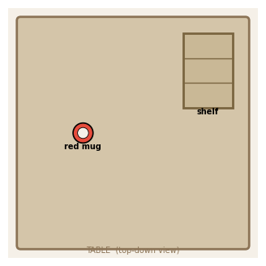
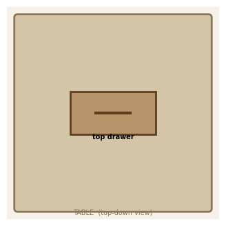
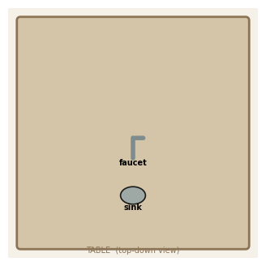
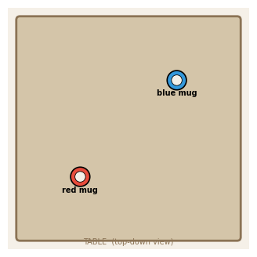
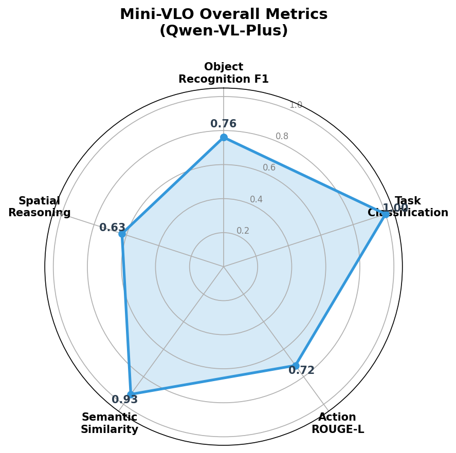
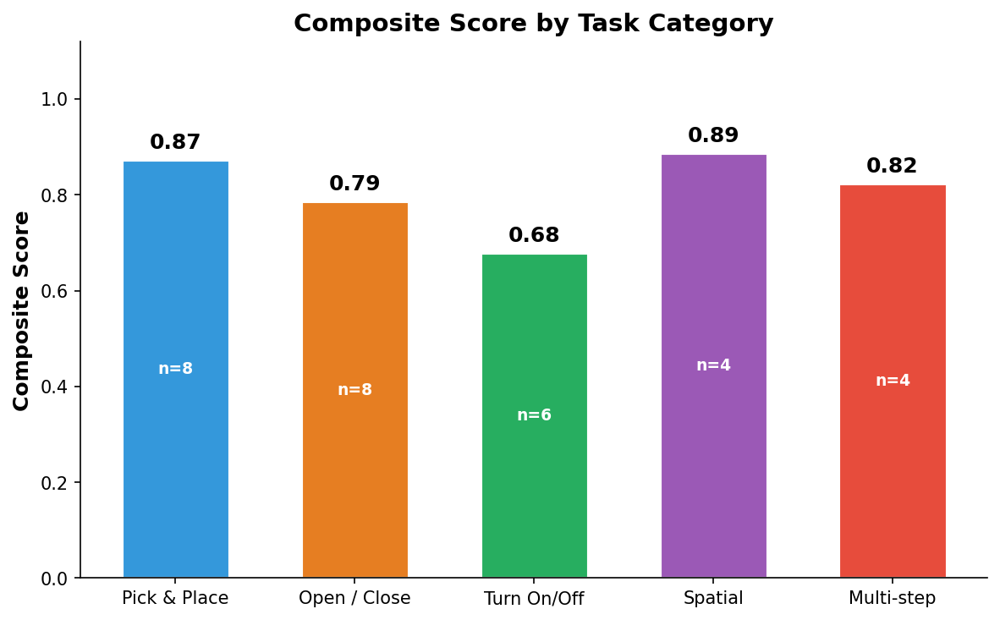
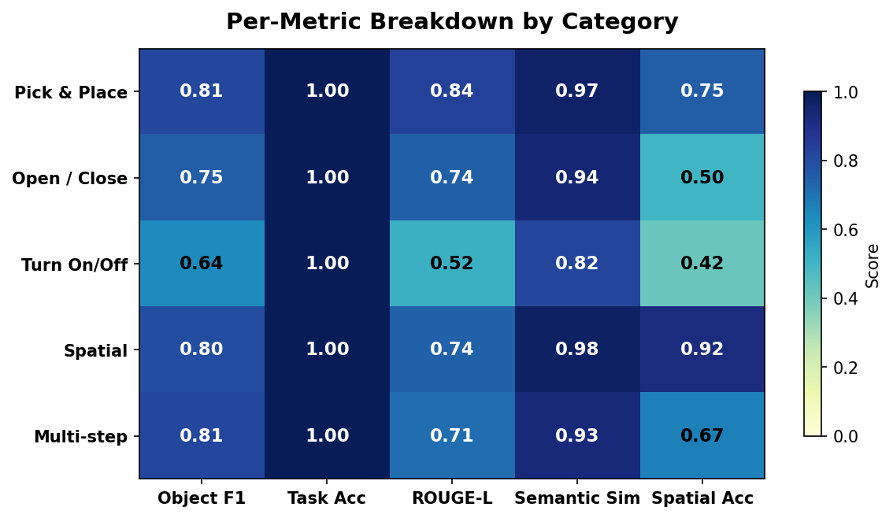

# Mini-VLO: Lightweight Robot Task Understanding Evaluator

A lightweight **Vision-Language Observer (VLO)** system that evaluates whether a VLM (Vision-Language Model) can correctly understand robot manipulation task scenes and natural language instructions. Inspired by [Being-H0.5](https://github.com/BeingBeyond/Being-H), this project tests the perceptual and reasoning foundation that underlies Vision-Language-Action (VLA) models — without requiring GPUs, large datasets, or action generation.

Runs entirely on **Apple Silicon Mac (M1 16GB)** using the Qwen-VL API.

## What is VLO?

In robotics, a **VLA (Vision-Language-Action)** model takes in camera images and language instructions, then outputs motor commands to control a robot. The pipeline looks like:

```
Camera Image + "Pick up the red mug" ──> VLA Model ──> Joint Angles / EEF Commands
```

A **VLO (Vision-Language Observer)** strips away the Action generation and focuses purely on whether the model can **understand** the scene:

```
Camera Image + "Pick up the red mug" ──> VLM ──> Structured Understanding (JSON)
```

Specifically, the VLM must output:
- **Object recognition**: What objects are in the scene?
- **Spatial reasoning**: How are they arranged?
- **Task classification**: What type of task is this?
- **Action planning**: What sequence of actions is needed?
- **Target identification**: Which object to interact with?

If a model cannot correctly see objects and understand instructions, it certainly cannot generate correct motor actions. VLO tests this foundational capability.

## Connection to Being-H

[Being-H0.5](https://github.com/BeingBeyond/Being-H) is a state-of-the-art VLA model from BeingBeyond that uses:
- **InternVL** (Vision Encoder) to extract visual features from robot camera images
- **Qwen LLM** to process language instructions alongside visual tokens
- **Flow-Matching Action Head** to generate 200-dimensional unified action vectors

```
┌─────────────┐    ┌───────────────┐    ┌──────────────┐
│  ViT (InternVL) │──>│  LLM (Qwen)   │──>│  Action Head │──> Robot Actions
│  Image Encoder  │   │  +Instruction  │   │  (200-dim)   │    (joint cmds)
└─────────────┘    └───────────────┘    └──────────────┘
       ▲                    ▲                    ▲
       │                    │                    │
   Vision (V)         Language (L)          Action (A)
```

Mini-VLO replaces the Action Head with **structured text output** and evaluates the V+L portion:

```
┌─────────────┐    ┌───────────────┐    ┌──────────────┐
│  Qwen-VL    │──>│  VLM Analysis  │──>│  JSON Output │──> Evaluation
│  (API)      │   │  +Instruction  │   │  (structured)│    (metrics)
└─────────────┘    └───────────────┘    └──────────────┘
       ▲                    ▲                    ▲
       │                    │                    │
   Vision (V)         Language (L)          Observer (O)
```

### Why Not Run Being-H Directly?

Being-H requires CUDA GPUs, FSDP distributed training, and datasets that are hundreds of GBs (LIBERO, RoboCasa). It cannot run on a MacBook. Mini-VLO provides a way to evaluate the **perceptual understanding** component using only a cloud VLM API.

## Benchmark Design

Since the original LIBERO/RoboCasa datasets are too large (~100s GB), we create a **synthetic benchmark** of 30 scenarios inspired by their task categories:

| Category | Inspired By | Count | Example |
|----------|-------------|-------|---------|
| Pick & Place | LIBERO spatial/object, RoboCasa PnP* | 8 | "Pick up the red mug and place it on the shelf" |
| Open / Close | RoboCasa OpenDrawer/CloseDoor | 8 | "Open the top drawer" |
| Turn On/Off | RoboCasa TurnOnStove/TurnOffFaucet | 6 | "Turn on the sink faucet" |
| Spatial | LIBERO spatial | 4 | "Move the blue bowl to the left of the plate" |
| Multi-step | LIBERO long-horizon | 4 | "Pick mug, put in microwave, close door" |

Each scenario includes a **generated schematic image** (top-down robot workspace view) and a **ground truth JSON** with objects, spatial relations, task type, action sequence, target object, and destination.

<p align="center">
  
  
  
  
</p>

## Evaluation Metrics

| Metric | What It Measures | Score Range |
|--------|-----------------|-------------|
| **Object Recognition F1** | Can the VLM identify all objects in the scene? | 0 - 1 |
| **Task Classification Accuracy** | Does it correctly identify the task type? | 0 or 1 |
| **Action Sequence ROUGE-L** | Does the predicted action plan match ground truth? | 0 - 1 |
| **Semantic Similarity** | Overall meaning alignment (bag-of-words cosine) | 0 - 1 |
| **Spatial Reasoning Accuracy** | Does it understand "left of", "on top of", etc.? | 0 - 1 |
| **Composite Score** | Weighted average (equal weights, 0.2 each) | 0 - 1 |

## Results

**Model**: Qwen-VL-Plus via DashScope API | **Scenarios**: 30 | **Date**: 2026-04-01

### Overall Performance

<p align="center">
  
</p>

| Metric | Score |
|--------|-------|
| Object Recognition F1 | **0.760** |
| Task Classification Accuracy | **1.000** |
| Action Sequence ROUGE-L | **0.718** |
| Semantic Similarity | **0.927** |
| Spatial Reasoning Accuracy | **0.628** |
| **Composite Score** | **0.807** |

### Performance by Category

<p align="center">
  
</p>

### Detailed Metric Breakdown

<p align="center">
  
</p>

### Analysis

**Strengths**:
- **Task Classification is perfect (1.000)**: Qwen-VL-Plus correctly identified the task type (pick_and_place, open, close, turn_on, turn_off, move) in all 30 scenarios. This is a strong signal that the VL backbone understands task intent well.
- **Semantic Similarity is very high (0.927)**: The overall meaning of predictions closely matches ground truth, indicating good holistic understanding.
- **Pick & Place scores highest (0.89)**: The most common robot task category is also the best understood.
- **Spatial Reasoning scores well (0.89)**: When the model encounters explicit spatial tasks, it handles "left of", "behind", "next to" correctly.

**Weaknesses**:
- **Spatial Reasoning in non-spatial tasks is low (overall 0.628)**: The model often says objects are "ON floor" or "ON counter" instead of "ON table", causing spatial relation mismatches in Open/Close and Turn On/Off categories.
- **Turn On/Off has the lowest composite (0.68)**: The model struggles with appliance-specific actions. For the stove, it outputs generic "interact with stove" instead of "grasp knob, rotate knob to turn on".
- **Object F1 is capped at ~0.80**: The model consistently misses "table" as an object since it considers it background rather than a distinct object.

**Implications for VLA**:
- The V+L understanding foundation is solid for common manipulation tasks. A Being-H-style action head built on top of this understanding would likely perform well on pick-and-place and spatial tasks.
- Appliance interaction (knobs, buttons, faucets) needs more specific visual grounding — the model sees the appliance but struggles to identify sub-components (knob, handle, button).
- This aligns with Being-H's own benchmark results where simpler tasks (PnP) outperform complex manipulation (multi-step sequences).

## Quick Start

### Prerequisites

- Python 3.10+
- A DashScope API key ([get one here](https://dashscope.console.aliyun.com/))

### Installation

```bash
git clone https://github.com/MarkfuGod/mini-vlo.git
cd mini-vlo
pip install -r requirements.txt
```

### 1. Generate Benchmark

```bash
python generate_benchmark.py
```

This creates 30 synthetic robot task images and `benchmark/scenarios.json`.

### 2. Run Evaluation

```bash
export DASHSCOPE_API_KEY="your-api-key-here"
python run_eval.py --model qwen-vl-plus
```

Options:
- `--model qwen-vl-max` for a more capable (but slower) model
- `--limit 5` to test with only the first 5 scenarios
- `--output results/my_run.json` to specify output path

### 3. Generate Charts

```bash
python generate_charts.py
```

Creates radar, bar, and heatmap charts in `assets/`.

## Project Structure

```
mini_vlo/
├── README.md
├── requirements.txt
├── generate_benchmark.py     # Generate synthetic benchmark images + ground truth
├── generate_charts.py        # Generate result visualization charts
├── run_eval.py               # Main evaluation entry point
├── src/
│   ├── vlm_engine.py         # Qwen-VL API client (OpenAI-compatible)
│   ├── evaluator.py          # Metrics engine (F1, ROUGE-L, cosine sim, etc.)
│   ├── prompts.py            # Structured VLM prompt templates
│   └── scenario.py           # Pydantic data models
├── benchmark/
│   ├── scenarios.json        # 30 scenario definitions with ground truth
│   └── images/               # Generated schematic workspace images
├── assets/                   # Charts for README
└── results/                  # Evaluation result JSONs (timestamped)
```

## Extending

- **Add more scenarios**: Edit `generate_benchmark.py` to add new task types or objects.
- **Swap the VLM**: Change `--model` or `--base-url` to point at any OpenAI-compatible vision API (GPT-4o, Claude, local Ollama, etc.).
- **Custom metrics**: Add new metric functions in `src/evaluator.py` and update the `WEIGHTS` dict.

## References

- [Being-H0.5: Scaling Human-Centric Robot Learning for Cross-Embodiment Generalization](https://arxiv.org/pdf/2601.12993) (BeingBeyond, 2026)
- [LIBERO: Lifelong Robot Learning Benchmark](https://github.com/Lifelong-Robot-Learning/LIBERO)
- [RoboCasa: Large-Scale Simulation for Everyday Tasks](https://github.com/robocasa/robocasa)
- [Qwen-VL](https://github.com/QwenLM/Qwen-VL) (Alibaba Cloud)

## License

MIT
